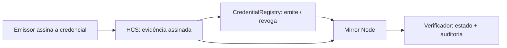

# Scaffold HBAR Verifiable Certificates

> Status: fundação do template para o Scaffold-HBAR Template Bounty. Direção decidida em
> [#21](https://github.com/fmartns/scaffold-hbar-verifiable-settlement/issues/21): emitir, verificar e revogar
> credenciais digitais na Hedera. O nome do repositório vem da direção anterior (liquidação verificável).

Template reutilizável para **certificados e credenciais verificáveis na Hedera**: uma organização emite um certificado,
qualquer pessoa confere se ele é autêntico e continua válido, e a organização pode revogá-lo se necessário.

## O problema

Organizações que emitem certificados (eventos de tecnologia, cursos, treinamentos, instituições de ensino,
certificações profissionais) hoje entregam um PDF ou um link para o próprio site. Quem recebe esse certificado, como
um empregador ou outra instituição, não tem como conferir sozinho se ele é verdadeiro:

- **Depende de confiar no emissor.** A única fonte é o sistema do próprio emissor, que pode sair do ar, ser alterado
  ou "corrigir" um registro sem deixar rastro.
- **Revogação é invisível.** Se um certificado é cancelado (erro, fraude, conduta), não há um lugar público e estável
  onde isso apareça, nem registro de quando e por quem foi feito.
- **Privacidade conflita com verificação.** Para provar que alguém recebeu um certificado, muitos sistemas expõem nome,
  e-mail ou documento do titular.

## Para quem é

- **Emissor**: o organizador de um evento, a escola, o curso ou a instituição certificadora. Quer emitir certificados
  que não possam ser falsificados em seu nome e poder revogá-los quando necessário, sem montar uma infraestrutura
  própria de confiança.
- **Verificador**: o empregador, outra instituição ou qualquer pessoa que recebe um link ou QR code. Quer saber em
  segundos se o certificado foi emitido por quem diz, se não foi alterado e se ainda vale, sem precisar de conta, de
  carteira ou de confiar no site do emissor.
- **Desenvolvedor**: quem usa este template para construir esse produto. Recebe o contrato, o SDK, a trilha de
  auditoria e os scripts prontos, e troca apenas o exemplo pelo seu caso.

## A proposta de valor

- **Verificável por qualquer pessoa.** O estado de cada certificado (emitido, revogado ou inexistente) fica em um
  contrato público na Hedera, não no servidor do emissor.
- **Ninguém reescreve o passado.** Um certificado emitido não pode ter o conteúdo ou o titular alterado, nem ser
  reemitido com outro conteúdo; uma revogação é definitiva e pública, com registro de quem a fez.
- **Trilha de evidência independente.** Cada emissão e revogação é publicada, assinada pelo emissor, em um registro
  com data e ordem garantidas pela rede (HCS), e pode ser auditada depois.
- **Dados pessoais ficam fora da rede.** Só vão para a Hedera o resumo criptográfico (hash) do documento e um
  compromisso que esconde o titular; o documento continua com o titular e o emissor.

## Genérico, com um evento como demo

O caso motivador é o **certificado de participação em evento**, usado como demonstração
([#42](https://github.com/fmartns/scaffold-hbar-verifiable-settlement/issues/42)). Ele é um exemplo, não o limite: o
mesmo contrato e o mesmo SDK servem cursos, diplomas, certificações profissionais, badges e treinamentos corporativos.
Nada no contrato conhece "evento": ele registra emissores, identificadores, hashes e o tipo de certificado (`schemaId`),
que cada aplicação define.

## Por que cada integração Hedera é indispensável

Remover qualquer uma das três peças quebra o propósito do template:

- **Sem o contrato (`CredentialRegistry`)**, o estado de um certificado voltaria a ser o que o servidor do emissor
  disser. Não haveria revogação pública e definitiva, nem garantia de que um administrador mal-intencionado do emissor
  não possa reescrever, reemitir ou "desrevogar" um certificado em silêncio.
- **Sem o HCS**, sobraria apenas o estado atual. Não haveria uma trilha independente, assinada e ordenada de cada
  emissão e revogação, publicada antes da transação, que permite provar o que foi assinado e quando, e detectar um
  emissor que assinou dois conteúdos diferentes para o mesmo certificado.
- **Sem o Mirror Node**, ninguém conseguiria cruzar o estado do contrato com a evidência do HCS sem rodar a própria
  infraestrutura: o contrato não lê o HCS, e é a auditoria pelo Mirror Node que liga as duas fontes, sem chave nenhuma.

A versão técnica deste argumento, o que já está implementado e o que ainda está planejado estão em
[docs/concepts.md](docs/concepts.md).

## Fluxo



O emissor assina a credencial (EIP-712) e publica a evidência no HCS antes de registrá-la no `CredentialRegistry`, que
confere a assinatura, o emissor autorizado e a unicidade. O verificador lê o estado no contrato (`statusOf`) e a
auditoria pelo Mirror Node confirma que a evidência do HCS bate com ele. O HCS é evidência, não validade: quem decide é
o contrato.

## Princípios
- Foundation, não demo: interfaces extensíveis e exemplos substituíveis.
- Contrato, HCS e Mirror Node têm papéis indispensáveis (veja acima).
- Sem secrets, chaves privadas ou credenciais no Git.
- Compatível com `npm create scaffold-hbar@latest -- --template fmartns/scaffold-hbar-verifiable-settlement`.

## Usar como template

```bash
npm create scaffold-hbar@latest -- --template fmartns/scaffold-hbar-verifiable-settlement
```

O `--` é obrigatório: sem ele o npm consome `--template` e o CLI não o recebe. Requer Node.js >= 20.18.3, Git com `user.name`/`user.email` e Yarn. O contrato de compatibilidade com o CLI está em [docs/scaffold-compat.md](docs/scaffold-compat.md).

## Comandos

Monorepo Yarn Workspaces (`packages/hardhat`, `packages/nextjs`, `packages/sdk`).

| Comando | O que faz |
|---|---|
| `yarn install` | Instala todas as dependências |
| `yarn doctor` | Verifica Node, Yarn e `.env` |
| `yarn setup` | Valida rede, conta e saldo Hedera (`cp .env.example .env` antes); encerra com erro claro se o ambiente for inválido |
| `yarn hts:token` | Cria um token HTS de desenvolvimento (tesouraria/chave de supply = operador). Mostra o plano e o custo (~US$ 1) e pergunta antes de criar; não cria um segundo se já houver um usável |
| `yarn hts:settle` | Testa o adapter HTS de verdade: `preflight` (checa, não envia), `associate`, `transfer` (mint/transfer real, só em `HEDERA_HTS_CUSTODY=operator`). Mostra o plano e o custo estimado e pergunta antes de enviar; `--label` deixa a liquidação repetível de propósito para testar idempotência |
| `yarn hcs:topic` | Cria o tópico HCS de evidência (`submitKey` = chave do operador). Mostra o que será criado e o custo estimado e pergunta `[Y/n]` antes; `--write` grava `HEDERA_HCS_TOPIC_ID` no `.env`, `--smoke-test` publica e lê de volta uma mensagem, `--yes` dispensa a pergunta. Não cria um segundo tópico se já houver um válido |
| `yarn dev` (ou `yarn start`) | Sobe o app Next.js em modo desenvolvimento |
| `yarn build` | Compila SDK, contratos e app |
| `yarn lint` | ESLint em todos os packages, sem warnings |
| `yarn check` | `lint` + `check-types` + `test` + `harness:doctor` (ciclo rápido de desenvolvimento) |
| `yarn self-check` | Gate de elegibilidade completo: `template.json`, README/AGENTS.md, licença, `.env` e secrets (gitleaks), install, lint, tipos, testes, build e boot com rotas principais. Aponta o requisito que falhou; é o que a CI executa ([docs/self-check.md](docs/self-check.md)) |
| `yarn secrets:scan` | Secret scan (gitleaks) do histórico git completo e do working tree, com valores sempre ocultos. Requer `gitleaks` instalado. Ver [docs/security.md](docs/security.md) |
| `yarn test` | Testes do SDK e dos contratos |
| `yarn harness:validate` | Validação determinística do Hedera Harness (tiers 0–1): arquivos, invariantes, varredura de segredos, `install --immutable`, `lint`, `check-types`, `test` e `build`. Use num clone limpo: falha de propósito se houver `.env` |

Planejados nas issues seguintes: `yarn test:integration`, `yarn test:e2e` e `yarn verify:testnet`.

Consulte [docs/concepts.md](docs/concepts.md) (narrativa, termos e status de implementação), [docs/architecture.md](docs/architecture.md) e [AGENTS.md](AGENTS.md).

Regras oficiais do bounty, gate de elegibilidade, rubrica e checklist de submissão: [docs/bounty-rules.md](docs/bounty-rules.md).

Hedera Harness: **adotado** nos tiers determinísticos (0–1). O harness spec e os validators estão em [`.harness/`](.harness/) e vão junto com cada projeto gerado; para estender o template com um agente, edite `.harness/prd.md` e rode `npx hedera-harness run`. Decisão, o que cada validator protege e por que os tiers 2, 3 e 3.5 não estão habilitados: [docs/harness.md](docs/harness.md).

Envelope de evidência HCS (schema estável v1) e serviço de publicação: [docs/hcs-envelope.md](docs/hcs-envelope.md). Fluxo: `yarn setup` → `yarn hcs:topic --write --smoke-test` → `HCS_INTEGRATION=1 yarn workspace @sh/sdk test:integration` (teste opcional na testnet).

Contrato de credenciais (emissão, revogação, autorização de emissor): [docs/credential-registry.md](docs/credential-registry.md). Auditoria de credenciais pelo Mirror Node: [docs/credential-audit.md](docs/credential-audit.md). Dashboard de ambiente: [docs/dashboard.md](docs/dashboard.md).

Benchmark de DX em scaffolds multi-chain e requisitos para #4, #24, #11 e #12: [docs/dx-benchmark.md](docs/dx-benchmark.md).

Os módulos abaixo vêm da direção anterior (liquidação) e ficam como histórico, fora do caminho crítico das credenciais ([#21](https://github.com/fmartns/scaffold-hbar-verifiable-settlement/issues/21)):

Interface de oracle e mock determinístico (para testes/CI/dev): [docs/oracle-adapter.md](docs/oracle-adapter.md).

Adapter HTS de liquidação (plano mint-transfer/pool-transfer, pré-condições, associação, idempotência, erros): [docs/hts-adapter.md](docs/hts-adapter.md). Teste opcional na testnet: `HTS_INTEGRATION=1 yarn workspace @sh/sdk test:integration`.
