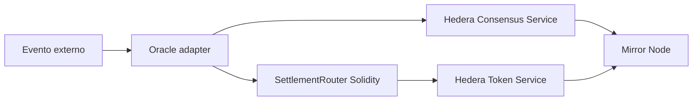

# Scaffold HBAR Verifiable Settlement

> Status: planejamento e fundação do template para o Scaffold-HBAR Template Bounty.

Template reutilizável para liquidação verificável baseada em eventos na Hedera.

## Fluxo

O oracle normaliza e assina/atesta o dado externo. O hash e metadados auditáveis são publicados no HCS; o contrato valida a regra e liquida crédito via HTS; Mirror Node fornece a trilha verificável.

## Princípios
- Foundation, não demo: interfaces extensíveis e exemplos substituíveis.
- HCS, HTS, Solidity, Mirror Node e oracle têm papéis indispensáveis.
- Sem secrets, chaves privadas ou credenciais no Git.
- Compatível com `npm create scaffold-hbar@latest -- --template fmartns/scaffold-hbar-verifiable-settlement`.

## Planejado
`yarn setup`, `yarn dev`, `yarn check`, `yarn test`, `yarn test:integration`, `yarn test:e2e` e `yarn verify:testnet`.

Consulte [docs/architecture.md](docs/architecture.md) e [AGENTS.md](AGENTS.md).

Regras oficiais do bounty, gate de elegibilidade, rubrica e checklist de submissão: [docs/bounty-rules.md](docs/bounty-rules.md).
