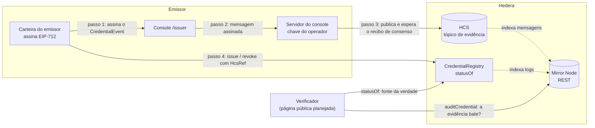

# Scaffold HBAR Verifiable Certificates

> Status: template para o Scaffold-HBAR Template Bounty. Emitir, verificar e revogar credenciais digitais na Hedera
> (direção decidida em [#21](https://github.com/fmartns/scaffold-hbar-verifiable-settlement/issues/21)). Contrato,
> evidência HCS, auditoria pelo Mirror Node e console do emissor estão implementados; o verificador público, o módulo
> completo de credenciais do SDK e a demo estão planejados ([o que está pronto](#o-que-está-pronto-e-o-que-está-planejado)).
> O nome do repositório vem da direção anterior ([por que mudou](#de-settlement-para-certificates)).

Template reutilizável para **certificados e credenciais verificáveis na Hedera**: uma organização emite um certificado,
qualquer pessoa confere se ele é autêntico e continua válido, e a organização pode revogá-lo se necessário.

## O problema

Organizações que emitem certificados (eventos de tecnologia, cursos, treinamentos, instituições de ensino,
certificações profissionais) hoje entregam um PDF ou um link para o próprio site. Quem recebe esse certificado, como
um empregador ou outra instituição, não tem como conferir sozinho se ele é verdadeiro:

- **Depende de confiar no emissor.** A única fonte é o sistema do próprio emissor, que pode sair do ar, ser alterado
  ou "corrigir" um registro sem deixar rastro.
- **Revogação é invisível.** Se um certificado é cancelado (erro, fraude, conduta), não há um lugar público e estável
  onde isso apareça, nem registro de quando e por quem foi feito.
- **Privacidade conflita com verificação.** Para provar que alguém recebeu um certificado, muitos sistemas expõem nome,
  e-mail ou documento do titular.

## Para quem é

- **Emissor**: o organizador de um evento, a escola, o curso ou a instituição certificadora. Quer emitir certificados
  que não possam ser falsificados em seu nome e poder revogá-los quando necessário, sem montar uma infraestrutura
  própria de confiança.
- **Verificador**: o empregador, outra instituição ou qualquer pessoa que recebe um link ou QR code. Quer saber em
  segundos se o certificado foi emitido por quem diz, se não foi alterado e se ainda vale, sem precisar de conta, de
  carteira ou de confiar no site do emissor.
- **Desenvolvedor**: quem usa este template para construir esse produto. Recebe o contrato, o SDK, a trilha de
  auditoria e os scripts prontos, e troca apenas o exemplo pelo seu caso.

## A proposta de valor

- **Verificável por qualquer pessoa.** O estado de cada certificado (emitido, revogado ou inexistente) fica em um
  contrato público na Hedera, não no servidor do emissor.
- **Ninguém reescreve o passado.** Um certificado emitido não pode ter o conteúdo ou o titular alterado, nem ser
  reemitido com outro conteúdo; uma revogação é definitiva e pública, com registro de quem a fez.
- **Trilha de evidência independente.** Cada emissão e revogação é publicada, assinada pelo emissor, em um registro
  com data e ordem garantidas pela rede (HCS), e pode ser auditada depois.
- **Dados pessoais ficam fora da rede.** Só vão para a Hedera o resumo criptográfico (hash) do documento e um
  compromisso que esconde o titular; o documento continua com o titular e o emissor.

## Genérico, com um evento como demo

O caso motivador é o **certificado de participação em evento**, usado como demonstração
([#42](https://github.com/fmartns/scaffold-hbar-verifiable-settlement/issues/42)). Ele é um exemplo, não o limite: o
mesmo contrato e o mesmo SDK servem cursos, diplomas, certificações profissionais, badges e treinamentos corporativos.
Nada no contrato conhece "evento": ele registra emissores, identificadores, hashes e o tipo de certificado (`schemaId`),
que cada aplicação define.

## Por que cada integração Hedera é indispensável

Remover qualquer uma das três peças quebra o propósito do template:

- **Sem o contrato (`CredentialRegistry`)**, o estado de um certificado voltaria a ser o que o servidor do emissor
  disser. Não haveria revogação pública e definitiva, nem garantia de que um administrador mal-intencionado do emissor
  não possa reescrever, reemitir ou "desrevogar" um certificado em silêncio.
- **Sem o HCS**, sobraria apenas o estado atual. Não haveria uma trilha independente, assinada e ordenada de cada
  emissão e revogação, publicada antes da transação, que permite provar o que foi assinado e quando, e detectar um
  emissor que assinou dois conteúdos diferentes para o mesmo certificado.
- **Sem o Mirror Node**, ninguém conseguiria cruzar o estado do contrato com a evidência do HCS sem rodar a própria
  infraestrutura: o contrato não lê o HCS, e é a auditoria pelo Mirror Node que liga as duas fontes, sem chave nenhuma.

A versão técnica deste argumento está em [docs/concepts.md](docs/concepts.md); o papel de cada serviço Hedera, com o
custo e o código correspondentes, em [docs/hedera.md](docs/hedera.md).

## Quickstart de 5 minutos

Sem conta Hedera, sem chave e sem `.env`: em cinco minutos você gera o projeto, roda o ciclo de vida completo de uma
credencial (emissor → HCS → `CredentialRegistry` → verificador) contra o contrato compilado e abre o app.

Pré-requisitos: Node.js >= 20.18.3, Git com `user.name`/`user.email` e Yarn (`corepack enable` habilita o Yarn que
vem com o Node).

```bash
npm create scaffold-hbar@latest -- --template fmartns/scaffold-hbar-verifiable-settlement
cd <nome-do-projeto>
yarn install          # se o CLI ainda não instalou
yarn doctor           # Node, Yarn e .env (sem .env é só um aviso)
yarn test             # SDK, contratos e frontend, offline: inclui o fluxo emissor → HCS → contrato → verificador
yarn dev              # http://localhost:3000
```

O `--` é obrigatório: sem ele o npm consome `--template` e o CLI não o recebe. Para clonar direto em vez de usar o CLI:
`git clone https://github.com/fmartns/scaffold-hbar-verifiable-settlement.git` e o mesmo `yarn install`.

Com o app no ar:

- <http://localhost:3000/dashboard> mostra rede, conta, relay, Mirror Node, tópico HCS e contrato. Sem `.env` tudo
  aparece como **Not configured**, cada item com o comando que resolve.
- <http://localhost:3000/issuer> é o console do emissor. Sem configuração ele explica o que falta e desabilita os
  formulários.

Para emitir uma credencial de verdade na Testnet (conta, tópico HCS, deploy, registro do emissor e primeira emissão,
cerca de 15 minutos), siga [docs/quick-start.md](docs/quick-start.md). Em resumo:

```bash
cp .env.example .env                  # preencha HEDERA_OPERATOR_ID e HEDERA_OPERATOR_KEY (portal.hedera.com)
yarn setup                            # valida rede, conta, chave e saldo
yarn hcs:topic --write --smoke-test   # cria o tópico de evidência e grava HEDERA_HCS_TOPIC_ID no .env
__RUNTIME_DEPLOYER_PRIVATE_KEY=0x<chave ECDSA> yarn deploy --network hederaTestnet
```

## Arquitetura



1. A carteira do emissor (o signer registrado do namespace) assina o `CredentialEvent` (EIP-712). Os identificadores e
   hashes vêm de um único módulo ([docs/credential-schema.md](docs/credential-schema.md)); o identificador do titular
   nunca sai do navegador, só um compromisso com sal.
2. O servidor do console publica a mensagem no HCS com a chave do operador e **espera o recibo de consenso antes** de
   qualquer transação no contrato (ADR-001 D11). Transaction ID e link do HashScan ficam registrados.
3. A carteira envia `issue` (ou `revoke`) ao `CredentialRegistry`, que confere assinatura, emissor autorizado, janela
   de validade e unicidade do `credentialId`. Nenhum papel altera ou reemite um registro existente.
4. O verificador lê `statusOf(credentialId)`: é o contrato que decide. Hoje isso está no card **Credential status** do
   dashboard e no painel de auditoria do console; a página pública `/verify/[credentialId]` é a
   [#40](https://github.com/fmartns/scaffold-hbar-verifiable-settlement/issues/40). A auditoria (`auditCredential`) cruza pelo
   Mirror Node os logs do contrato com a evidência do HCS; dado ainda não indexado é `pending`, nunca "ausente".

**HCS é evidência, não validade**: o contrato não lê o HCS, e a auditoria explica `statusOf`, nunca o substitui.

Pacotes: `packages/hardhat` (Solidity, deploy, testes), `packages/sdk` (Hedera, HCS, Mirror Node, credenciais,
configuração de rede; consumido como TypeScript), `packages/nextjs` (dashboard, console do emissor e rotas de API).
Decisões normativas: [docs/architecture.md](docs/architecture.md) (ADR-001: modelo de confiança, identidade e
idempotência; [ADR-002](docs/architecture.md#adr-002--credentials-privacy-on-chain-vs-off-chain-and-data-model): privacidade e modelo de dados das credenciais, fonte normativa do
`CredentialRegistry`; ADR-003: Hedera Harness).

### O que está pronto e o que está planejado

| Peça | Status | Documentação |
|---|---|---|
| `CredentialRegistry`: emissores, `issue`, `revoke`, rotação de signer, pausa, deploy | Implementado | [credential-registry.md](docs/credential-registry.md) |
| Modelo de dados e identificadores (`schemaId`, `credentialId`, commitments) | Implementado | [credential-schema.md](docs/credential-schema.md) |
| Tópico HCS de evidência e publicação com recibo de consenso | Implementado | [hcs-envelope.md](docs/hcs-envelope.md) |
| Auditoria pelo Mirror Node (`auditCredential`) | Implementado | [credential-audit.md](docs/credential-audit.md) |
| Console do emissor (`/issuer`) | Implementado | [issuer-console.md](docs/issuer-console.md) |
| Dashboard de ambiente (`/dashboard`, `GET /api/env/status`) | Implementado | [dashboard.md](docs/dashboard.md) |
| Verificador público (`/verify/[credentialId]`, link e QR code) | Planejado | [#40](https://github.com/fmartns/scaffold-hbar-verifiable-settlement/issues/40) |
| Módulo completo de credenciais do SDK (build, sign, publish, issue, verify, revoke) | Planejado; o console usa a parte mínima já existente | [#41](https://github.com/fmartns/scaffold-hbar-verifiable-settlement/issues/41) |
| Demo de certificado de participação em evento | Planejado | [#42](https://github.com/fmartns/scaffold-hbar-verifiable-settlement/issues/42) |

## Variáveis de ambiente

Um único `.env` na raiz alimenta os três pacotes. A fonte da verdade é `envVars` em `template.json`, do qual o CLI gera
o `.env.example`; os dois são mantidos iguais (`node scripts/validate-template.mjs`). Nenhuma variável usa o prefixo
`NEXT_PUBLIC_`: tudo é lido no servidor, e chave nenhuma chega ao navegador. Todas podem ficar vazias para rodar
`yarn test` e `yarn dev`; a coluna "Quem lê" diz o que deixa de funcionar sem ela.

**Rede e conta** (validadas por `yarn setup`, [docs/integration.md](docs/integration.md#environment-validation)):

| Variável | O que é | Quem lê | Exemplo / padrão |
|---|---|---|---|
| `HEDERA_NETWORK` | Rede alvo: `testnet`, `mainnet` ou `local` (Hedera Local Node) | Todos | Vazio = `testnet` |
| `HEDERA_RPC_URL` | Relay JSON-RPC do servidor e do Hardhat | Deploy, servidor | Vazio = Hashio público da rede (só para desenvolvimento). O navegador sempre usa o relay público |
| `HEDERA_MIRROR_NODE_URL` | Mirror Node REST | `yarn setup`, auditoria, dashboard | Vazio = Mirror Node público da rede |
| `HEDERA_OPERATOR_ID` | Conta do operador (`0.0.x`) que paga a publicação no HCS | `yarn setup`, `yarn hcs:topic`, console do emissor | `0.0.4515123` |
| `HEDERA_OPERATOR_KEY` | Chave privada do operador, hex (DER ou 32 bytes crus; ED25519 ou ECDSA). **Segredo**: nunca no Git, nunca no navegador | Os mesmos | Do portal, junto com a conta |
| `HEDERA_MIN_BALANCE_HBAR` | Saldo mínimo exigido por `yarn setup` | `yarn setup` | Vazio = 20 (testnet), 10 (mainnet), 1 (local) |

**Credenciais** (o caminho principal do template):

| Variável | O que é | Quem lê | Exemplo / padrão |
|---|---|---|---|
| `HEDERA_HCS_TOPIC_ID` | Tópico HCS da evidência, com `submitKey` = chave do operador. `yarn hcs:topic --write` cria e grava | Console do emissor, deploy do `CredentialRegistry` (vira `hcsTopicNum`), dashboard | `0.0.5123456` |
| `HEDERA_CREDENTIAL_REGISTRY_ADDRESS` | Endereço EVM do `CredentialRegistry` implantado; também é o domínio EIP-712 das assinaturas | Console do emissor e auditoria (obrigatório); dashboard (cai no manifesto de `packages/sdk/generated` se vazio) | O endereço impresso por `yarn deploy` |
| `HEDERA_HCS_PUBLISH_TIMEOUT_MS` | Prazo total de uma publicação no HCS (1000 a 120000) | Publicador HCS | Vazio = 30000 |
| `HEDERA_AUDIT_POLL_TIMEOUT_MS` | Quanto a auditoria espera o Mirror Node indexar antes de responder `pending` (0 a 300000) | Auditoria, painel de auditoria do console | Vazio = 20000 |

**Deploy**:

| Variável | O que é | Quem lê | Exemplo / padrão |
|---|---|---|---|
| `DEPLOYER_PRIVATE_KEY_ENCRYPTED` | Reservada para um keystore criptografado do deployer; nenhum código a lê hoje. Não preencha | Ninguém (ainda) | Vazio |

`yarn deploy` usa a chave em `__RUNTIME_DEPLOYER_PRIVATE_KEY`, passada no shell só para aquele comando e nunca gravada
no `.env`. Não existe chave padrão: sem ela, o deploy em rede real falha em vez de usar uma chave conhecida.

**Direção anterior (liquidação)**: lidas apenas pelos módulos de oracle e HTS, que ficam como histórico e não fazem
parte do fluxo de credenciais. Deixe vazias.

| Variável | O que é |
|---|---|
| `HEDERA_SETTLEMENT_ROUTER_ADDRESS` | Endereço de um `SettlementRouter` (não existe neste repositório); domínio EIP-712 do envelope de liquidação |
| `HEDERA_HTS_TOKEN_ID` | Token HTS liquidado; `yarn hts:token` cria um de desenvolvimento |
| `HEDERA_HTS_SETTLEMENT_MODEL` | `mint-transfer` (padrão) ou `pool-transfer` |
| `HEDERA_HTS_CUSTODY` | `router` (padrão) ou `operator` (só desenvolvimento/Testnet; recusado na mainnet) |
| `HEDERA_HTS_TREASURY_ID` | Tesouraria na custódia `operator`; vazio = conta do operador |
| `ORACLE_PROVIDER` | `mock` (padrão, determinístico, sem credenciais) ou um provider real (#23) |
| `ORACLE_BASE_URL` | URL base do provider de oracle |
| `ORACLE_TIMEOUT_MS` | Prazo de uma consulta ao oracle; vazio = 10000 |
| `ORACLE_MAX_AGE_SECONDS` | Idade máxima de uma observação antes de assinar; vazio = 300 |
| `ORACLE_VALIDITY_SECONDS` | Validade padrão de uma atestação; vazio = 900 |
| `ORACLE_API_KEY` | Chave do provider, se ele exigir. **Segredo** |

Detalhes: [docs/hts-adapter.md](docs/hts-adapter.md) e [docs/oracle-adapter.md](docs/oracle-adapter.md).

## Customização

**Um novo tipo de credencial (schema).** Não exige mudar o contrato: o tipo é só o `schemaId`.

1. Escreva o descriptor canônico, por exemplo `workshop-attendance.v1(string workshop,uint64 heldOn,uint64 hours)`
   (regras em [docs/credential-schema.md §3.2](docs/credential-schema.md#32-schemaid)). Mudar um campo é uma nova versão.
2. Adicione um `preset(...)` em `CREDENTIAL_SCHEMA_PRESETS` (`packages/sdk/hedera/credentials/fields.ts`) com rótulo,
   tipo de input e um placeholder concreto para cada campo. O console do emissor passa a oferecê-lo no select.
3. Defina o `reference` do emissor seguindo C1–C6 (nunca dado pessoal nem campo volátil) e cubra o novo preset em
   `fields.test.ts`. Nunca derive `schemaId`, `credentialId` ou hashes fora de `schema.ts`.

**Um novo contrato.**

1. Crie o `.sol` em `packages/hardhat/contracts/`, os testes em `packages/hardhat/test/` (cobertura de 100% de linhas
   exigida por `yarn coverage`) e um script em `packages/hardhat/deploy/`.
2. Rode `yarn codegen`: ABIs e tabela de erros vão para `packages/sdk/generated/` (commitado, nunca editado à mão; a CI
   falha se estiver desatualizado). `yarn deploy --network hederaTestnet` registra endereço e contract id no manifesto.
3. Consuma com `getDeployedContract("<Nome>", network)` no SDK ou `useDeployedContract` no React, nunca com um
   endereço literal ([docs/integration.md](docs/integration.md#contract-abi-and-address-codegen)). Se o contrato for
   um módulo de fonte única, atualize `.harness/validators/static.json` ([docs/harness.md](docs/harness.md)).

**Trocar de rede.**

- `HEDERA_NETWORK=testnet|mainnet|local`. Chain ids e URLs de RPC, Mirror Node e HashScan vivem só em
  `packages/sdk/hedera/networks.ts`; para um provider próprio use `HEDERA_RPC_URL` e `HEDERA_MIRROR_NODE_URL`.
- A rede do Hardhat correspondente é `hederaTestnet`, `hederaMainnet` ou `hederaLocal`. Cada rede precisa do seu tópico
  HCS, do seu deploy e do seu registro de emissor: nada é compartilhado entre redes.
- `local` usa o Hedera Local Node (relay em `127.0.0.1:7546`, Mirror Node em `127.0.0.1:5551`, chain 298).
- Mainnet: `yarn hcs:topic` e os scripts HTS recusam sem `--allow-mainnet`, e a custódia `operator` é recusada. Antes,
  passe pelo checklist de [docs/deployment.md](docs/deployment.md) e [docs/security.md](docs/security.md).

## Comandos

Monorepo Yarn Workspaces (`packages/hardhat`, `packages/nextjs`, `packages/sdk`).

| Comando | O que faz |
|---|---|
| `yarn install` | Instala todas as dependências |
| `yarn doctor` | Verifica Node, Yarn e `.env` |
| `yarn setup` | Valida rede, conta e saldo Hedera (`cp .env.example .env` antes); encerra com erro claro se o ambiente for inválido |
| `yarn hcs:topic` | Cria o tópico HCS de evidência (`submitKey` = chave do operador). Mostra o que será criado e o custo estimado e pergunta `[Y/n]` antes; `--write` grava `HEDERA_HCS_TOPIC_ID` no `.env`, `--smoke-test` publica e lê de volta uma mensagem, `--yes` dispensa a pergunta. Não cria um segundo tópico se já houver um válido |
| `yarn verify:testnet` | Valida o fluxo completo de credencial na Testnet real: preflight do ambiente, emissão (recibo de consenso HCS antes do `CredentialRegistry`), auditoria pelo Mirror Node até ficar consistente, tentativas deliberadas de reemissão (devem ser bloqueadas), revogação e nova auditoria. Mostra o plano e o custo estimado e pergunta antes de pagar (`--yes` dispensa); `--dry-run` só checa. Recusa mainnet. Grava a evidência (transaction IDs, links HashScan, tempos, relatórios de auditoria) em `docs/evidence/testnet/` ([docs/testnet-validation.md](docs/testnet-validation.md)) |
| `yarn demo:event-attendance` | Roda o exemplo "Event Attendance Certificate" de ponta a ponta, offline e deterministicamente (sem `.env`, sem credenciais, sem rede): emite uma credencial real pelo fluxo de emissor de produção, gera o QR code do id da credencial, verifica ACTIVE, revoga e verifica REVOGADO de novo, contra uma Hedera falsa em memória. Runbook reutilizável para a bounty #20 em [docs/demo-event-attendance.md](docs/demo-event-attendance.md) |
| `yarn deploy` | `--network hederaTestnet` (ou `hederaLocal`): implanta o `CredentialRegistry` e regenera `packages/sdk/generated` com endereço e contract id. Exige `__RUNTIME_DEPLOYER_PRIVATE_KEY` e `HEDERA_HCS_TOPIC_ID` |
| `yarn codegen` | Regenera ABIs e tabela de erros a partir dos contratos compilados, sem rede |
| `yarn dev` (ou `yarn start`) | Sobe o app Next.js em modo desenvolvimento; `yarn serve` serve o build de produção |
| `yarn build` | Compila SDK, contratos e app |
| `yarn lint` | ESLint em todos os packages, sem warnings |
| `yarn check-types` | TypeScript em todos os packages (compila os contratos antes) |
| `yarn format` | Prettier em todos os packages |
| `yarn check` | `lint` + `check-types` + `test` + `harness:doctor` (ciclo rápido de desenvolvimento) |
| `yarn self-check` | Gate de elegibilidade completo: `template.json`, README/AGENTS.md, licença, `.env` e secrets (gitleaks), install, lint, tipos, testes, build e boot com rotas principais. Aponta o requisito que falhou; é o que a CI executa ([docs/self-check.md](docs/self-check.md)) |
| `yarn secrets:scan` | Secret scan (gitleaks) do histórico git completo e do working tree, com valores sempre ocultos. Requer `gitleaks` instalado. Ver [docs/security.md](docs/security.md) |
| `yarn test` | Testes do SDK, dos contratos (incl. o fluxo emissor → HCS → contrato → verificador) e do frontend; offline, sem credenciais |
| `yarn coverage` | Os mesmos testes com cobertura; falha abaixo das metas de [docs/testing.md](docs/testing.md) |
| `yarn harness:validate` | Validação determinística do Hedera Harness (tiers 0–1): arquivos, invariantes, varredura de segredos, `install --immutable`, `lint`, `check-types`, `test` e `build`. Use num clone limpo: falha de propósito se houver `.env` |
| `yarn hts:token`, `yarn hts:settle` | Direção anterior: token HTS de desenvolvimento e teste manual do adapter HTS ([docs/hts-adapter.md](docs/hts-adapter.md)) |

Planejados nas issues seguintes: `yarn test:integration` e `yarn test:e2e`.

Testes opcionais na Testnet (gastam HBAR, nunca rodam na CI): `HCS_INTEGRATION=1 yarn workspace @sh/sdk test:integration`.

## Troubleshooting

Erros reais, com a mensagem que aparece. A lista completa está em [docs/troubleshooting.md](docs/troubleshooting.md).

| Sintoma | Causa e solução |
|---|---|
| `Usage Error: Couldn't find the node_modules state file - running an install might help` | Clone novo sem install: rode `yarn install`. Antes do install, o gate roda como `node scripts/self-check.mjs` |
| `x [MISSING_ENV] HEDERA_OPERATOR_ID is not set or is empty.` | Sem `.env`: `cp .env.example .env` e preencha conta e chave do [portal](https://portal.hedera.com) |
| `x [KEY_MISMATCH] HEDERA_OPERATOR_KEY does not belong to account 0.0.x` | Chave de outra conta. Use a chave criada junto com a conta |
| `x [ACCOUNT_NOT_FOUND] Account 0.0.x does not exist on testnet` | A Testnet é resetada periodicamente: crie uma conta nova e atualize ID e chave |
| `Secret scan could not run: gitleaks was not found` | `brew install gitleaks` (ou o binário das releases) ou `GITLEAKS_BIN=/caminho` |
| Deploy: `TypeError: Cannot read properties of undefined (reading 'length')` | Falta `__RUNTIME_DEPLOYER_PRIVATE_KEY` no shell |
| Console: `Wrong network: The wallet is on chain 1, but this console targets chain 296.` | Carteira em outra rede; aceite a troca que o console oferece |
| Auditoria `pending_index` logo após emitir | O Mirror Node ainda está indexando (segundos). Não é erro; o painel consulta de novo |

## Documentação

| Assunto | Documento |
|---|---|
| Quick start completo (Testnet) | [docs/quick-start.md](docs/quick-start.md) |
| Narrativa, termos e status | [docs/concepts.md](docs/concepts.md) |
| Arquitetura e decisões (ADR-001, ADR-002, ADR-003) | [docs/architecture.md](docs/architecture.md) |
| Privacidade e modelo de dados das credenciais (ADR-002: papéis, on-chain vs off-chain, commitment do titular, trade-offs; fonte normativa do `CredentialRegistry`) | [ADR-002](docs/architecture.md#adr-002--credentials-privacy-on-chain-vs-off-chain-and-data-model) |
| O que cada serviço Hedera faz aqui e por quê | [docs/hedera.md](docs/hedera.md) |
| Contrato `CredentialRegistry` | [docs/credential-registry.md](docs/credential-registry.md) |
| Modelo de dados e identificadores | [docs/credential-schema.md](docs/credential-schema.md) |
| Evidência HCS | [docs/hcs-envelope.md](docs/hcs-envelope.md) |
| Auditoria pelo Mirror Node | [docs/credential-audit.md](docs/credential-audit.md) |
| Console do emissor | [docs/issuer-console.md](docs/issuer-console.md) |
| Dashboard de ambiente | [docs/dashboard.md](docs/dashboard.md) |
| Integrações, codegen de ABI e validação de ambiente | [docs/integration.md](docs/integration.md) |
| Deploy | [docs/deployment.md](docs/deployment.md) |
| Testes | [docs/testing.md](docs/testing.md) |
| Segurança | [docs/security.md](docs/security.md) |
| Self-check e CI | [docs/self-check.md](docs/self-check.md) |
| Hedera Harness | [docs/harness.md](docs/harness.md) |
| Troubleshooting | [docs/troubleshooting.md](docs/troubleshooting.md) |
| Compatibilidade com o CLI | [docs/scaffold-compat.md](docs/scaffold-compat.md) |
| Regras do bounty e benchmark de DX | [docs/bounty-rules.md](docs/bounty-rules.md), [docs/dx-benchmark.md](docs/dx-benchmark.md) |
| Pacote de submissão (#20) | [docs/submission-package.md](docs/submission-package.md) |
| Guia para agentes | [AGENTS.md](AGENTS.md) |

Hedera Harness: **adotado** nos tiers determinísticos (0–1). O harness spec e os validators estão em [`.harness/`](.harness/) e vão junto com cada projeto gerado; para estender o template com um agente, edite `.harness/prd.md` e rode `npx hedera-harness run`. Decisão, o que cada validator protege e por que os tiers 2, 3 e 3.5 não estão habilitados: [docs/harness.md](docs/harness.md).

## De settlement para certificates

O projeto começou como **liquidação verificável**: um oracle atestava um fato, o HCS registrava, um `SettlementRouter`
decidia e o HTS pagava. Na escolha do caso de uso
([#21](https://github.com/fmartns/scaffold-hbar-verifiable-settlement/issues/21)) a direção mudou para certificados:
o problema é concreto para quem emite e quem verifica, não depende de um oracle externo para ser demonstrado e usa as
três integrações de forma indispensável. As garantias foram mantidas (identidade determinística, uma única emissão por
chave, HCS antes da transação, auditoria pelo Mirror Node); mudou o objeto, de liquidação para credencial. Por isso o
repositório mantém o nome antigo, o ADR-001 descreve a liquidação e os módulos de oracle e HTS continuam no código como
histórico, fora do caminho crítico das credenciais.

## Princípios
- Foundation, não demo: interfaces extensíveis e exemplos substituíveis.
- Contrato, HCS e Mirror Node têm papéis indispensáveis (veja acima).
- Sem secrets, chaves privadas ou credenciais no Git.
- Compatível com `npm create scaffold-hbar@latest -- --template fmartns/scaffold-hbar-verifiable-settlement`
  ([docs/scaffold-compat.md](docs/scaffold-compat.md)).

Licença: [MIT](LICENSE).
