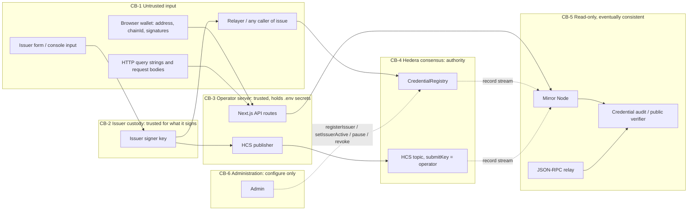

# Security: threat model, trust boundaries and Definition of Done

This document is the security baseline of the repository (issue #17). It covers the credential issue/revoke flow
(`CredentialRegistry`, #9), the SDK that feeds and audits it (#5, #10), secret handling, and the checklist every pull
request must pass. ADR-001 ([architecture.md](architecture.md)) stays normative for identity, idempotency and replay.
This document does not restate those rules. It applies them to the credential flow and records what is still open.

Last review: 2026-10-01. Code reviewed on `main` at `c64ab0d`. History scanned across 31 commits on every local and
remote branch, merge commits included.

## 1. Assets

| Asset | Where it lives | Why it matters |
|---|---|---|
| Issuer signer key (secp256k1 EOA) | Issuer's custody, never in this repo | It is the only authority for `issue` and the issuer path of `revoke` |
| Admin key (`DEFAULT_ADMIN_ROLE`, `ADMIN_ROLE`) | Deployer at deploy time; a multisig is recommended | It registers and deactivates namespaces, pauses issuance and can revoke any credential |
| Operator key (`HEDERA_OPERATOR_KEY`) | Root `.env`, server-side only | It pays fees and holds the HCS topic `submitKey`, so it is the only key that can write evidence |
| Deployer key (`DEPLOYER_PRIVATE_KEY_ENCRYPTED`) | Encrypted keystore in `.env`, decrypted at runtime into `__RUNTIME_DEPLOYER_PRIVATE_KEY` | It deploys contracts and becomes the initial admin |
| Oracle API key (`ORACLE_API_KEY`) | Root `.env`, server-side only | It grants access to a paid data provider (#23) |
| Credential records | `CredentialRegistry` storage | They are the source of truth that verifiers read (`statusOf`) |
| HCS evidence | Topic `HEDERA_HCS_TOPIC_ID` | Auditors use it to reconstruct and check every issuance and revocation |
| Subject privacy | Off-chain only; on-chain is a salted `subjectCommitment` | Personal data must never reach calldata, HCS or logs (NG-3) |

## 2. Trust boundaries of the credential flow



| Crossing | Validated by | Enforcement |
|---|---|---|
| CB-1 to CB-2 (form data becomes a signed `CredentialEvent`) | `packages/sdk/hedera/hcs/credential-envelope.ts` (field formats, EIP-55, zero values, `submitter` required) | Off-chain, preventive. The issuer signs only after validation |
| CB-2 to CB-4 via HCS | Topic `submitKey` (checked by `verifyHcsTopic`) | Platform. The network does not validate content |
| CB-1 (relayer) to CB-4 (`issue`) | Everything `CredentialRegistry.issue` checks: structure, active issuer, EIP-712 signature (low-`s`, domain bound to chain and contract), uniqueness, freshness, `submitter` pin | **On-chain. This is the only boundary with full enforcement** |
| CB-1 to CB-3 (`GET /api/wallet/account?address=`) | `lookupEvmAccount`: strict `^0x[0-9a-fA-F]{40}$` before any fetch; fixed Mirror URL from `networks.ts`; response shape checked | Off-chain, preventive |
| CB-1 (wallet) to browser UI | `isTargetChain` parses `eth_chainId` strictly; the chain added to a wallet always uses the public relay from `networks.ts` | Off-chain. The wallet is never trusted for state: the UI shows what the chain says |
| CB-3 to browser | `checkHederaHealth` report: URLs reduced to origin; no key enters the report (tested) | Off-chain, preventive |
| CB-4 to CB-5 | None. Mirror data is derived; the audit records origins and the highest consensus timestamp it saw | Detective |
| CB-6 to CB-4 | `AccessControl` roles; every change emits an event | On-chain |

Rules that follow from the table:

- **Nothing in CB-1 is trusted until a CB-4 check accepts it.** Client-side validation is for UX only. The contract is
  the gate.
- **`HcsRef` is a claim, not a verified fact.** The contract checks only `sequence != 0`. Never display it as verified
  on-chain. Only the audit, which decodes the HCS message, can confirm it.
- **The Mirror Node and the relay are not authorities.** A verifier shows `statusOf` together with the time of the read.
  Absent Mirror data inside the index budget is `pending`, never "missing".
- **Secrets never cross CB-3.** No `NEXT_PUBLIC_` secret, no full RPC or Mirror URL, no key material in a report, log,
  error message or exception. Client code imports values only from the client-safe subpaths (`@sh/sdk/hedera/wallet`, `contracts`, `audit/registry`, `networks`). ESLint enforces this for
  `app/**/_components`, `components` and `hooks`.

## 3. Threat model: credential issue and revoke

Severity is the impact if the mitigation fails. "Residual" is what remains after the mitigation.

| # | Threat | What happens today | Mitigation | Residual |
|---|---|---|---|---|
| T-1 | **Issuer signer key compromised** | The attacker can issue any credential under that namespace and revoke any of its credentials. Revocation is final, so it cannot be undone. The attacker can also call `rotateIssuerSigner` first and lock the real issuer out. | Admin calls `setIssuerActive(false)`. This freezes issuance, issuer revocation and rotation at once. Admin then revokes the forged credentials. Forged issuances lack matching HCS evidence unless the attacker also holds the operator key, so the audit flags them (`HCS_NOT_FOUND`, `HCS_*_MISMATCH`). Keep the issuer signer and the operator key separate. | Credentials forged or revoked between compromise and deactivation. The namespace cannot be re-keyed by design (the admin cannot rotate a signer), so the issuer moves to a new namespace. See F-2. |
| T-2 | **Re-issuing an existing credential** | Same `credentialId` with the same content reverts `AlreadyIssued`. Different content reverts `ConflictingCredential`, and authenticity is checked first, so a conflict always means a valid signature, which is evidence of equivocation. A revoked id can never be issued again. Cross-chain and cross-deployment replay fails the EIP-712 domain. Malleable signatures revert. | `credentialId = keccak256(tag, issuer, externalCredentialId)` is permanent and never a hash, signature or nonce (ADR §4.3). Tests pin every case. | None on-chain. `credentialId` is not bound to a deployment, so a verifier must pin the registry address and chain id (from `networks.ts` and the deployment), not just the id. |
| T-3 | **Admin revokes or alters another issuer's credential** | Revoke: allowed by design. The event records `byAdmin = true`. Alter: impossible, because no function changes `issuer`, `credentialHash`, `subjectCommitment` or `signer` of a record, and a test pins the full list of state-changing functions. The admin cannot issue, rotate an issuer's signer or re-register its namespace. | Multisig admin; every action emits an event; verifiers can surface `byAdmin`. | A compromised admin can mass-revoke (irreversible), pause issuance indefinitely, deactivate issuers, or register a **new** namespace with its own key and issue under it. Mapping a namespace to a real organization is off-chain trust. See F-4. |
| T-4 | **Mirror Node lagging during public verification** | The audit polls with backoff until `HEDERA_AUDIT_POLL_TIMEOUT_MS`, reports `pending_index` inside the 60 s index budget and `unavailable` when Mirror fails. `statusOf` stays the authority. Note that the Hedera JSON-RPC relay answers `eth_call` from Mirror Node state, so even `statusOf` can trail consensus by a few seconds right after a revocation. | The report never overrides `statusOf`. It records the highest consensus timestamp it observed. | A credential revoked seconds ago can still read `issued`. The public verifier (#40) must show the read time and must not cache a "valid" answer. |
| T-5 | **Front-running `issue` with a forged `HcsRef`** | D11 publishes the event and its signature to HCS **before** `issue`, so anyone reading the topic can submit that signature first. When `submitter = 0`, the contract accepts any caller, and `HcsRef` is not part of the signed struct. The record is correct, but `CredentialIssued` permanently carries the attacker's `HcsRef`, so the audit reports the valid credential as `inconsistent`. | Production issuers set `submitter` to their relayer address, which blocks the front-run. | Evidence griefing for events signed with `submitter = 0`. See F-1. |
| T-6 | **Forged verifier off-chain** (phishing site showing "valid") | Out of contract scope. | The verifier shows the registry address, chain and HashScan links so anyone can check `statusOf` independently. `HcsRef` is never presented as verified. | Users who do not check. |
| T-7 | **Operator key compromised** | The attacker can publish to the HCS topic and spend the operator's HBAR. They cannot issue credentials (no issuer signature) or alter records. | Separate the operator key from issuer and admin keys; HCS consumers verify signatures and dedupe by digest; rotate the topic `submitKey`. | Evidence noise and fee drain until the key is rotated. |
| T-8 | **Censoring or withholding relayer** | `issue` is permissionless, so any party can relay the same signed payload unless `submitter` is pinned. | The issuer runs its own relayer; if needed, re-sign with another `submitter`. | Delay (ADR NG-2). |
| T-9 | **Subject privacy leak** | Only `subjectCommitment` (salted) and hashes go on-chain or to HCS. | The salt never leaves issuer custody; the data model belongs to ADR-002. | Payloads are public (NG-3). A weak salt allows a dictionary attack on the commitment. |
| T-10 | **Developer console exposed publicly** | `/api/env/status` and `/api/wallet/account` have no authentication or rate limit. They return the operator account, its balance (public on Hedera anyway) and network config, and proxy address lookups to Mirror. | The report is secret-free by construction (tested). | Information disclosure and a Mirror proxy if deployed publicly. See F-3. |

## 4. Code review of trust boundaries (2026-10-01)

| Area | Untrusted input | Result |
|---|---|---|
| `CredentialRegistry.issue` | Event, signature, `HcsRef`, caller | OK. Checks in the documented order; `tryRecoverCalldata` rejects malleable signatures; authenticity before uniqueness; `HcsRef` is only emitted, never trusted. F-1 applies. |
| `CredentialRegistry.revoke` / admin functions | Caller | OK. Issuer path requires an active namespace and its current signer; admin cannot alter records. F-2 and F-4 apply. |
| `packages/sdk/hedera/hcs/credential-envelope.ts` | Issuer-supplied event fields, HCS bytes | OK. Strict formats, EIP-55, required `submitter`, single decoder for HCS credential messages. |
| `packages/sdk/hedera/audit` | Mirror Node and RPC responses | OK. Polling with deadline; absent data is `pending`; provenance records origins only. |
| `packages/sdk/hedera/environment.ts`, `health.ts` | `.env`, network responses | OK. Key used server-side only, never in messages; URLs reduced to origin (tested with secrets in path and query). |
| `packages/nextjs/app/api/wallet/account/route.ts` | `address` query param | OK. Validated against `^0x[0-9a-fA-F]{40}$` before any request; fixed Mirror base from `networks.ts`; `Cache-Control: no-store`. F-3 applies. |
| `packages/nextjs/app/api/env/status/route.ts` | None | OK. Secret-free report. F-3 applies. |
| Client components (`app/dashboard/_components`) | Wallet (EIP-1193) | OK. Only type imports from the SDK root; values from the client-safe subpaths (`@sh/sdk/hedera/wallet`, `contracts`, `audit/registry`, `networks`). Now enforced by ESLint (F-6). |
| `packages/hardhat/hardhat.config.ts`, deploy script | `.env` | OK. No default deployer key; live networks have no account without the runtime key; `HEDERA_HCS_TOPIC_ID` required on live networks. |
| `scripts/*.mjs`, `packages/sdk/cli/*` | CLI args, `.env` | OK. Output never includes key material; mainnet refused without `--allow-mainnet`. |

## 5. Findings

| ID | Severity | Status | Finding | Recommendation |
|---|---|---|---|---|
| F-1 | Medium | Open | `HcsRef` is unsigned and the signed event is public in HCS before `issue` (D11). With `submitter = 0`, anyone can front-run `issue` with a bogus `HcsRef`, permanently making a valid credential's evidence `inconsistent`. The same pattern exists for `SettlementEvent`. | (a) Issuer tooling (#12) must default `submitter` to the issuer's relayer and treat `0` as an explicit opt-in. (b) The audit should, on `HCS_REF_MISMATCH`/`HCS_NOT_FOUND`, look for the issuance by digest in the topic and report "evidence exists, `HcsRef` forged by relayer `tx.from`" instead of content tampering. Decide in ADR-002. |
| F-2 | Medium | Open (by design, documented) | A compromised issuer key can rotate the signer first (locking the real issuer out) and revoke all of that namespace's credentials irreversibly before the admin deactivates it. No namespace recovery exists. | Runbook in section 7. ADR-002 should weigh a timelocked rotation or a governance-gated re-key, and whether irreversible issuer revocation needs a delay. |
| F-3 | Low | Open | The developer console API routes have no authentication or rate limit. | Keep the console local or behind authentication; add rate limiting before any public deployment (#14/#40). |
| F-4 | Low | Open | The deploy script makes the deployer EOA both `DEFAULT_ADMIN_ROLE` and `ADMIN_ROLE`. A multisig is recommended but nothing enforces or automates the handover. | Before mainnet: grant both roles to a multisig, renounce them from the deployer, and record the transactions on HashScan. |
| F-5 | Info | Fixed | No automated secret scanning existed. | Added `.gitleaks.toml`, `scripts/secret-scan.mjs` and `yarn secrets:scan`, ready for #14. |
| F-6 | Low | Fixed | The client import boundary (client-safe SDK subpaths only) was documented but not enforced. | ESLint `@typescript-eslint/no-restricted-imports` in `packages/nextjs`, type imports allowed. |
| F-7 | Low | Fixed | `.gitignore` did not cover key files or scan reports. | Added `*.pem`, `*.key`, `*.p12`, `*.pfx`, `*.keystore`, `keystore.json`, `gitleaks-report*.json`. |

## 6. Secret scanning

### Tooling

- `.gitleaks.toml` keeps the gitleaks default rules and adds rules for the formats this project handles: Hedera
  ED25519 and ECDSA DER private keys, 32-byte hex keys assigned to key-like names, and mnemonics. Allowlists are narrow
  and documented. They cover the minified Yarn release and generated output, plus public 32-byte identifiers, hashes
  and commitments (`eventKey`, `credentialId`, `credentialHash`, `subjectCommitment`, digests). The generic rule
  mistakes these for keys, and the allowlist applies to that rule only.
- `scripts/secret-scan.mjs` (`yarn secrets:scan`) scans:
  - **history**: `gitleaks git --log-opts="--all -m"`, every ref including what merge commits introduce. A shallow
    clone is refused (exit 2) rather than reported clean.
  - **working tree**: tracked files plus untracked files that are not gitignored (the local `.env` is skipped on purpose).
  - `--self-test`: generates fake keys at runtime (never committed) and asserts each custom rule fires and the
    allowlists hold.
- Exit codes: `0` clean, `1` findings, `2` could not run. Output shows rule, file, line and commit only. Values are
  always redacted.

### Wiring for CI (#14)

The pipeline belongs to #14. These are the steps it needs:

```yaml
- uses: actions/checkout@v4
  with:
    fetch-depth: 0 # the history scan refuses shallow clones
- name: Install gitleaks
  run: |
    curl -sSfL -o gitleaks.tgz https://github.com/gitleaks/gitleaks/releases/download/v8.30.1/gitleaks_8.30.1_linux_x64.tar.gz
    # verify against the published checksums file before extracting
    tar -xzf gitleaks.tgz gitleaks && sudo mv gitleaks /usr/local/bin/
- run: node scripts/secret-scan.mjs --self-test
- run: node scripts/secret-scan.mjs
```

### Result of this review

| Scan | Scope | Result |
|---|---|---|
| gitleaks 8.30.1, project config | 31 commits on every local and remote branch (including in-flight `issue-38-credential-event`), merge commits included, plus all 14 GitHub `refs/pull/*/head` (all already reachable) | **0 findings** |
| gitleaks 8.30.1, project config | Working tree (186 files) | **0 findings** |
| gitleaks 8.30.1, default rules only | Same history | 6 hits, all false positives. Two are public `eventKey` golden vectors (`packages/sdk/hedera/hcs/envelope.test.ts:28` and `publisher.test.ts:57`, commit `68b0e74`). Three are public `credentialHash` golden vectors (`packages/sdk/hedera/credentials/schema.test.ts:54,62,70`, commit `45e377d`). One is minified identifiers in `.yarn/releases/yarn-3.2.3.cjs:127` (commit `3b1439c`). |
| Manual history review | Every `.env*`, `*.pem`, `*.key` or keystore file ever added; DER key prefixes; key, mnemonic and API key assignments | Only `.env.example` was ever committed, with empty values. DER prefixes in tests are truncated 20-byte fragments (a real ED25519 DER key is 48 bytes), most ending in `deadbeef`. Other matches are variable names or obvious literals (`"cd".repeat(32)`, `"01".repeat(32)`, `"TOPSECRET-relay-token"`). No unreachable commits and no stashes. |

**Conclusion: no secret was found in the current tree or anywhere in the commit history.**

## 7. Incident response

**A secret was committed or pushed.**
1. Rotate it first: create a new key or account, move funds and roles, update the topic `submitKey` if it is the
   operator key. Removing a secret from history does not un-leak it.
2. Then rewrite history (`git filter-repo`), force-push, ask GitHub support to purge cached views and closed PR refs,
   and rerun `yarn secrets:scan`.

**An issuer signer key leaked (T-1).**
1. Admin: `setIssuerActive(issuer, false)` immediately. Do not reactivate while the leaked key is the signer.
2. Run the audit over the namespace's recent `CredentialIssued` events. Issuances without matching HCS evidence, or
   unknown to the issuer's records, are forged: revoke them as admin.
3. Register a new namespace for the issuer and re-issue legitimate credentials under it. Publish the incident.

**The admin key leaked.** Use the remaining `DEFAULT_ADMIN_ROLE` holder to revoke the role from the leaked address. If
the leaked key is the only `DEFAULT_ADMIN_ROLE` holder, the deployment can no longer be trusted: redeploy and announce
the new registry address.

## 8. Prohibited practices

- Committing secrets, private keys, mnemonics, real account credentials or a filled `.env`, including in tests,
  fixtures, docs, screenshots or commit messages. Test keys are built at runtime or are obviously synthetic
  (`"01".repeat(32)`), never copied from a real account.
- `NEXT_PUBLIC_` on any secret; reading `HEDERA_OPERATOR_KEY`, `ORACLE_API_KEY` or a deployer key in client code; value
  imports from the SDK root in client code.
- Putting a private key, a full RPC or Mirror URL (beyond its origin), or raw provider errors that may echo a key into a
  log, message, report, exception or HTTP response.
- Re-implementing environment validation, HCS parsing, oracle composition, HTS calls or credential audit outside their
  single module (see `AGENTS.md`).
- Presenting `HcsRef` or Mirror data as verified on-chain; letting a report override `statusOf`; treating absent
  Mirror data as "missing" inside the index budget.
- Using a payload hash, signature or nonce as an idempotency key; hashing JSON to derive an identifier.
- Releasing an attestation before its HCS consensus receipt (D11); retrying an HCS publish inside the publisher.
- Giving any role the power to issue, mint, settle, or alter a processed record (D12).
- Signing production events with `submitter = 0` without a reason recorded in the issuer's configuration (F-1).
- Using the same key as issuer signer, operator and admin on any network beyond local development.
- Allowlisting a whole directory in `.gitleaks.toml`, or silencing a finding without documenting why it is public.

## 9. Security Definition of Done (every pull request)

A PR is not done until every applicable item holds. Reviewers check them; CI enforces the automated ones.

**Secrets**
- [ ] `yarn secrets:scan` exits `0` (history and tree), and `--self-test` passes if `.gitleaks.toml` changed.
- [ ] A new secret-bearing variable has a `template.json` entry (regenerated into `.env.example`) whose description
      says it is secret and server-side only, and never uses the `NEXT_PUBLIC_` prefix.
- [ ] New logs, errors and reports are tested to exclude key material and non-origin URLs.

**Trust boundaries**
- [ ] Every new input from a form, wallet, query string, request body or external API is validated at the boundary
      (format, bounds, timeout) before use, and the PR says where.
- [ ] Anything a user relies on for validity is enforced on-chain, not only in the UI or SDK.
- [ ] Client code imports values only from the client-safe subpaths (`@sh/sdk/hedera/wallet`, `contracts`, `audit/registry`, `networks`) (ESLint).
- [ ] New external integrations have an interface, a timeout, validation and a deterministic fixture.

**Contracts**
- [ ] New or changed state-changing functions are in the pinned function-list test, with access control tests for
      every role, including the negative cases.
- [ ] No role can issue, mint, settle or alter a processed record; authenticity is checked before uniqueness.
- [ ] Signed structs, type strings and domains are pinned by tests and mirrored in the SDK envelope.
- [ ] Every HTS response code is checked (`SUCCESS = 22`).

**Evidence and audit**
- [ ] HCS publications persist the transaction ID and HashScan URL, and are published before release (D11).
- [ ] UI and reports never present `HcsRef` or Mirror data as verified on-chain; verifiers show `statusOf` with the
      time of the read.

**Process**
- [ ] `yarn check` passes; the threat model (section 3) and findings (section 5) are updated when the PR changes a
      trust boundary, a role or a key.
- [ ] Testnet changes include HashScan evidence, and no mainnet action runs without `--allow-mainnet`.
